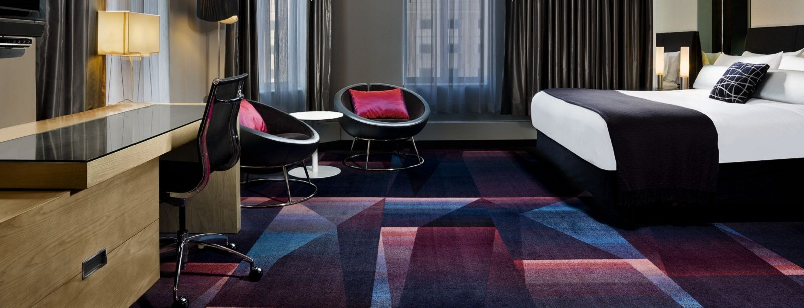
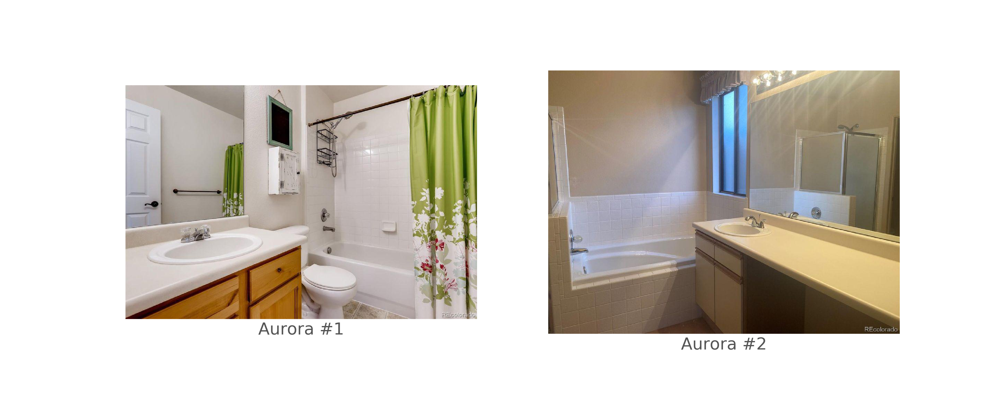
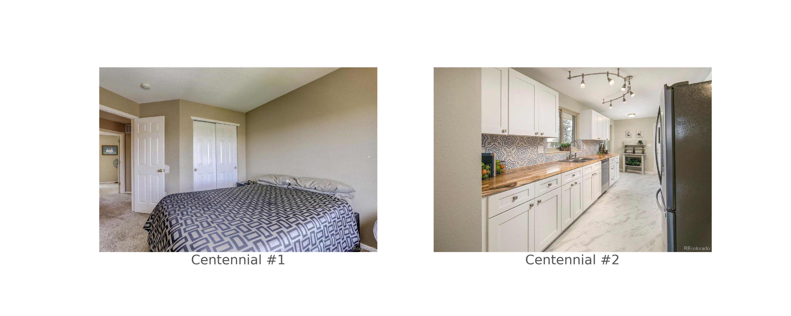
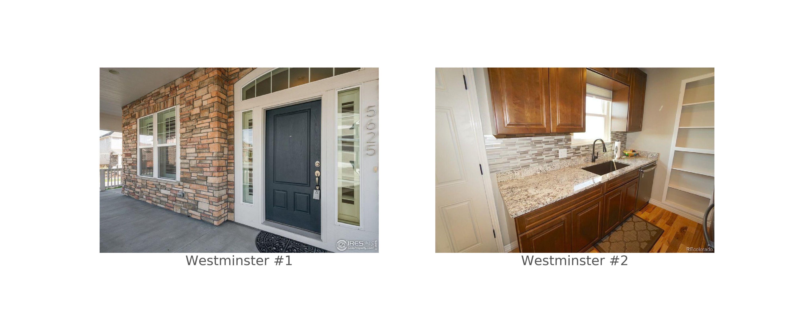

# Homes Like This: Real Estate Search Optimizer, Pt. 1

    

Connor Slagle

# Table of Contents

1. [Motivation](#Motivation)
2. [The Dataset](#The-Dataset)
3. [Webscraping](##Webscraping)
4. [Exploratory Data Analysis](#Exploratory-Data-Analysis)
5. [Image Processing](#Image-Processing)
5. [Naive Bayes Classifier](#Naive-Bayes-Classifier)
6. [Conclusion](#Conclusion)
7. [Next Steps](#Next-Steps)
8. [References](#References)

# Motivation

Have you ever looked into a room and thought - I could live in here? Have you ever envied your neighbor's home woodshop/bar/workout all-in-one combo room? I have. Having a space in your home to relax is important. It's why many of us spend a lot time looking though countless online photos of possible dwellings before pulling the trigger. Can't there be a better way?

I think there is! Let computer's do the work for us. 

According to [Realtor.com](https://www.realtor.com/advice/buy/how-many-homes-will-it-take/), the average time it takes to find yout dream home is 10 weeks - with touring roughly 10 homes in that time. Most people have about [1-2 hours](https://www.quora.com/How-much-free-time-does-the-average-person-have-This-does-not-include-time-spent-at-work-or-on-house-work-like-cooking-dinner?share=1) of freetime per day - when looking for a houme this number can easily go to 0. During this process any time you can squeeze out for yourself is golden. 

With this in mind, I decided to build a search optimizer that can recommend **where** to look for your next home based on images of rooms you already like.

# The Dataset

The dataset was collected by webscraping [Realtor.com](https://www.realtor.com/). For a proof of concept, roughly 10,000 images were scraped on May 12th - 13th, 2020 from the seven municipalities around the Denver Metro Area with a [population > 100,000](https://en.wikipedia.org/wiki/Denver_metropolitan_area#Places_with_over_100,000_inhabitants). Of the 10,000 images, only ~5,600 of them were unique and included in the final dataset. A brief descrion of the data source is below:

Municipality | Pop. (2018, est.) | Listings Avail. (5/13/2020) | Listings Scraped | Images Scraped | Images/Listing
|---|---:|---:|---:|---:|---:|
Denver | 727,000 | 3,700 | 45 | 1,250 | 28
Aurora | 374,000 | 1,900 | 37 | 800 | 22
Lakewood | 156,000 | 510 | 30 | 770 | 26
Thornton | 139,000 | 700 | 34 | 600 | 18
Arvada | 120,000 | 500 | 34 | 840 | 25
Westminster | 113,000 | 320 | 26 | 620 | 24
Centennial | 110,000 | 340 | 28 | 700 | 25
**Total** | **1,740,000** | **8,000** | **234** | **5,570** | **24**

## Webscraping

Webscraping is a tricky beast. Mainly because websites are so good at detecting automated data collectors (bots). A common workflow for webscraping is to request the page HTML, process with HTML-parser (shout out Beautiful Soup), then store in a NoSQL database. This workflow works really well when scraping from a single web-page; however, it suffers at scale as synchronous requests are slow and easy to identify by websites. 

Therefore, I scraped the data with the [Scrapy](https://scrapy.org/) python library. The Scrapy workflow is shown below:

    

Scrapy is build on an asynchronous [Twisted](https://twistedmatrix.com/trac/) engine that controls web-page requests, webscrapers (spiders), and data post-processing. Additionally, custom 'middleware' can be added for further functionality.

With scrapy in my toolbelt, feeling confident, I tried to scrape Realtor.com - and was hit with a 403 - Unauthorized Request. I modified my code, tried again, and was redirected to their ['/robots.txt'](https://www.realtor.com/robots.txt) page. For those of you who are unaware of the 'robots.txt' rule of webscraping, as I was, here's a snippet from Realtor.com:

    

This file describes which robots are allowed to scrape the website - I assure you I was not on the list. Luckily, a 'downloader middleware' called [Scrapy-Selenium](https://github.com/clemfromspace/scrapy-selenium) allowed for Selenium controlled requests - disguising my Scrapy requests as Firefox requests. 

# Exploratory Data Analysis 

After webscraping, the data was imported to Pandas. A random sample of 5 entries is shown below.

| Index | Listing ID | Address  | City | State  |   Zip Code | Image Filename | Property Type    | List Price   |   Num. Beds |   Num. Baths | sq.ft. |
|---:|:---|:---|:---|:---|---:|---:|---:|:----|:---|:---|---:|
| 2484 | Denver_CO_1_23  |   1093-W-69th-Ave            | Denver      | CO      |      80221 | m166232535xd-w1020_h770_q80.jpg  | Listing for Sale | $374,900     |           3 |          2.5 | 1,440    |
|  270 | Westminster_CO_1_1    |  3591-Kassler-Pl       | Westminster | CO      |      80031 | m1745295948xd-w1020_h770_q80.jpg | House for Sale   | $335,000     |           3 |          2.0  | 1,850   |
|  593 | Westminster_CO_1_2   |   7941-Stuart-St        | Westminster | CO      |      80030 | m2085618000xd-w1020_h770_q80.jpg | House for Sale   | $385,000     |           4 |          1.5 | 1,781    | 
| 4985 | Denver_CO_3_9    |   5380-N-Argonne-St         | Denver      | CO      |      80249 | m2762133823xd-w1020_h770_q80.jpg | House for Sale   | $333,595     |           4 |          3.0 | 1,701    | 
| 3479 | Aurora_CO_1_32  |    6632-S-Muscadine-Ct       | Aurora      | CO      |      80016 | w1113822923xd-w1020_h770_q80.jpg | House for Sale   | $495,000     |           3 |          2.5 | 3,255    | 

To start off, I wanted to make sure my webscraper collected data in equal proportions.

    

Well. Not exactly the same. To get a better understanding of these 5,000 images, I figured it would be nice to look at a few per city.

    

    

    

    

    

    

    

# Image Processing

To process the images, I built a 

    

# Naive Bayes Classifier

# Conclusion

# Next Steps

# References

