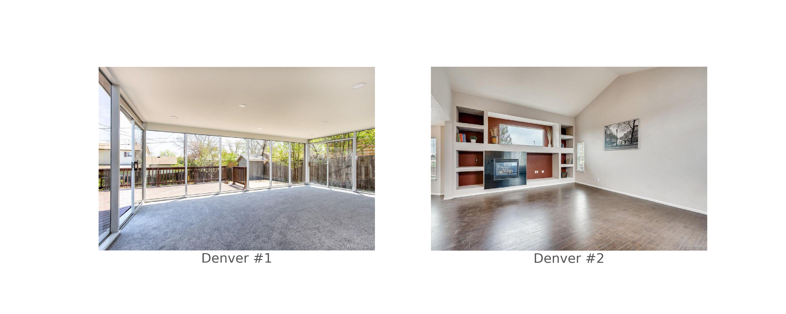
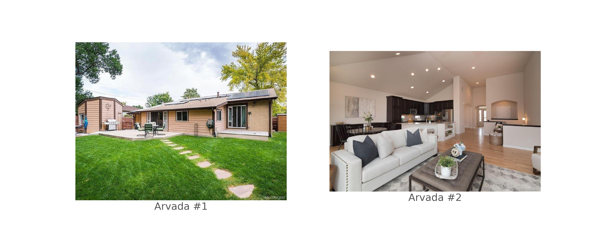
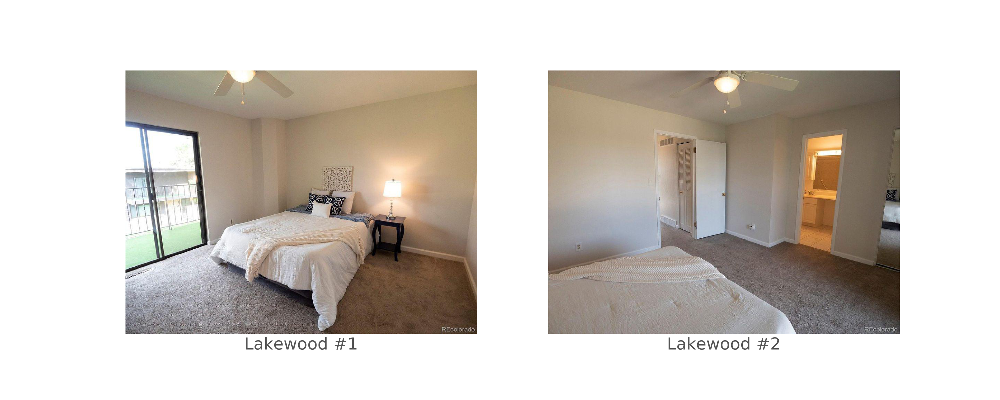
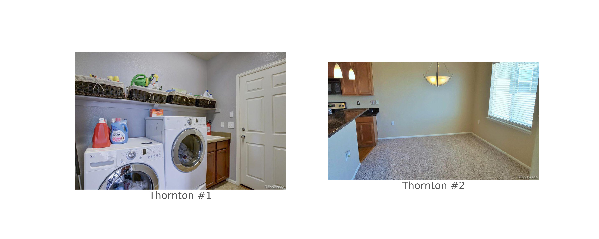

# Real Estate Search Recommender

Readme under development. Feel free to browse the ppt version below. If you have any questions, please contact me at connor.slagle@colorado.edu.

Thank you!
Connor

<object data="images/presentation.pdf" type="application/pdf" width="700px" height="700px">
    <embed src="images/presentation.pdf">
        
This browser does not support PDFs. View and/or download the PDF here: <a href="images/presentation.pdf">PDF</a>.

    </embed>
</object>

<!--

<!-- Connor Slagle

# Table of Contents

1. [Motivation](#Motivation)
2. [The Dataset](#The-Dataset)
3. [Webscraping](##Webscraping)
4. [Exploratory Data Analysis](#Exploratory-Data-Analysis)
5. [Image Processing](#Image-Processing)
5. [Naive Bayes Classifier](#Naive-Bayes-Classifier)
6. [Conclusion](#Conclusion)
7. [Next Steps](#Next-Steps)
8. [References](#References)

# Motivation

Have you ever looked into a room and thought - I could live in here? Have you ever envied your neighbor's home wood shop/bar/workout all-in-one combo room? I have. Having a space in your home to relax is important. It's why many of us spend a lot time looking though countless online photos of possible dwellings before pulling the trigger. Can't there be a better way?

I think there is! Let computer's do the work for us. 

According to [Realtor.com](https://www.realtor.com/advice/buy/how-many-homes-will-it-take/), the average time it takes to find your dream home is 10 weeks - with touring roughly 10 homes in that time. Most people have about [1-2 hours](https://www.quora.com/How-much-free-time-does-the-average-person-have-This-does-not-include-time-spent-at-work-or-on-house-work-like-cooking-dinner?share=1) of free time per day - when looking for a home this number can easily go to 0. During this process any time you can squeeze out for yourself is golden. 

With this in mind, I decided to build a search optimizer that can recommend **where** to look for your next home based on images of rooms you already like.

# The Dataset

The dataset was collected by webscraping [Realtor.com](https://www.realtor.com/). For a proof of concept, roughly 10,000 images were scraped on May 12th - 13th, 2020 from the seven municipalities around the Denver Metro Area with a [population > 100,000](https://en.wikipedia.org/wiki/Denver_metropolitan_area#Places_with_over_100,000_inhabitants). Of the 10,000 images, only ~5,600 of them were unique and included in the final dataset. A brief description of the data source is below:

Municipality | Pop. (2018, est.) | Listings Avail. (5/13/2020) | Listings Scraped | Images Scraped | Images/Listing
|---|---:|---:|---:|---:|---:|
Denver | 727,000 | 3,700 | 45 | 1,250 | 28
Aurora | 374,000 | 1,900 | 37 | 800 | 22
Lakewood | 156,000 | 510 | 30 | 770 | 26
Thornton | 139,000 | 700 | 34 | 600 | 18
Arvada | 120,000 | 500 | 34 | 840 | 25
Westminster | 113,000 | 320 | 26 | 620 | 24
Centennial | 110,000 | 340 | 28 | 700 | 25
**Total** | **1,740,000** | **8,000** | **234** | **5,570** | **24**

## Webscraping

Webscraping is a tricky beast. Mainly because websites are so good at detecting automated data collectors (bots). A common work flow for webscraping is to request the page HTML, process with HTML-parser (shout out Beautiful Soup), then store in a No-SQL database. This work flow works really well when scraping from a single web-page; however, it suffers at scale as synchronous requests are slow and easy to identify by websites. 

Therefore, I scraped the data with the [Scrapy](https://scrapy.org/) python library. The Scrapy work flow is shown below:

Scrapy is build on an asynchronous [Twisted](https://twistedmatrix.com/trac/) engine that controls web-page requests, webscrapers (spiders), and data post-processing. Additionally, custom 'middleware' can be added for further functionality.

With scrapy in my tool belt, feeling confident, I tried to scrape Realtor.com - and was hit with a 403 - Unauthorized Request. I modified my code, tried again, and was redirected to their ['/robots.txt'](https://www.realtor.com/robots.txt) page. For those of you who are unaware of the 'robots.txt' rule of webscraping, as I was, here's a snippet from Realtor.com:

This file describes which robots are allowed to scrape the website - I assure you I was not on the list. Luckily, a 'downloader middleware' called [Scrapy-Selenium](https://github.com/clemfromspace/scrapy-selenium) allowed for Selenium controlled requests - disguising my Scrapy requests as Firefox requests. 

# Exploratory Data Analysis 

After webscraping, the data was imported to Pandas. A random sample of 5 entries is shown below.

| Index | Listing ID | Address | City | State | Zip Code | Image Filename | Property Type | List Price | Num. Beds | Num. Baths | sq.ft. |
|---:|:---|:---|:---|:---|---:|---:|---:|:----|:---|:---|---:|
| 2484 | Denver_CO_1_23 | 1093-W-69th-Ave | Denver | CO | 80221 | m166232535xd-w1020_h770_q80.jpg | Listing for Sale | $374,900 | 3 | 2.5 | 1,440 |
| 270 | Westminster_CO_1_1 | 3591-Kassler-Pl | Westminster | CO | 80031 | m1745295948xd-w1020_h770_q80.jpg | House for Sale | $335,000 | 3 | 2.0 | 1,850 |
| 593 | Westminster_CO_1_2 | 7941-Stuart-St | Westminster | CO | 80030 | m2085618000xd-w1020_h770_q80.jpg | House for Sale | $385,000 | 4 | 1.5 | 1,781 | 
| 4985 | Denver_CO_3_9 | 5380-N-Argonne-St | Denver | CO | 80249 | m2762133823xd-w1020_h770_q80.jpg | House for Sale | $333,595 | 4 | 3.0 | 1,701 | 
| 3479 | Aurora_CO_1_32 | 6632-S-Muscadine-Ct | Aurora | CO | 80016 | w1113822923xd-w1020_h770_q80.jpg | House for Sale | $495,000 | 3 | 2.5 | 3,255 | 

To start off, I wanted to make sure my webscraper collected data in equal proportions.

Well. Not exactly the same. To get a better understanding of these 5,000 images, I figured it would be nice to look at a few per city.

As seen in the Arvada subgroup - some of these images are of the house from the outside. Not shown above, there are also images of empty lots, chicken coops, and other unforeseen images.

# Image Processing

Unfortunately, the images from Realtor.com are 1000x700 color images. In order to train a machine learning model, I preprocessed them with a pipeline.

First, the images were cropped square.

Then the images were gray-scaled and reduced. I collected 32x32, 64x64, 128x128, and 256x256. Afterwards, I visually checked to see at which point the image was visually unrecognizable.

At 32x32 it becomes difficult to where an object begins and ends; however, smaller images are easier to featurize.

# Naive Bayes Classifier

As an initial step, I wanted to see how a relatively simple model classified the images. I chose to use a Naive Bayes (NB) classifier as they have been shown to predict relatively well on raveled images, although neighboring pixels are hardly independent. 

Initially, I split the data into holdout and train/test groups with 20% of the data stored in the holdout set. An additional 20% of the data was held out for testing, with the remainder comprising the train set. 

Since I was not able to stratify my data set splits - I tried k-fold cross validation with the train/test data sets. Hopefully this would average out any uneven class proportions in the holdout set.

For NB classifiers, a 'wide' dataset (number of features >> number of targets) is preferred as you can get a better estimation of the posterior probabilities with more priors. With this being the case, I trained my model on gray scaled images, size 256x256. I was both pleasantly and negatively surprised when the results finished.

| split | 4 Folds | 10 Folds | 14 Folds | 18 Folds
|:---|---:|---:|---:|---:|
| train | 0.224 | 0.220 | 0.219 | 0.219 |
| test | 0.18 | 0.177 | 0.183 | 0.184

You're eyes aren't deceiving you - that's an accuracy of 0.184. However, I was surprised that the accuracy was not affected very much by the number of k-folds.

I chose a k-fold of 18 to train my final model on. **The accuracy on the holdout data was 0.178** - a couple points above random guessing; for 7 classes, the expected accuracy is 0.143.

Although the accuracy leaves much to be desired, I was excited to look at the confusion matrices to see which cities scored the highest.

In the confusion matrices above, the values shown are normalized counts **by true value (rows sum to 1)**. If you focus your attention to the diagonal, you can see Lakewood was predicted with the most accurate in both test and holdout datasets. However, Westminster is not far behind.

To get a better understanding of how my model performed, I tested the performance with the [Matthews Correlation Coefficient (MCC)](https://en.wikipedia.org/wiki/Matthews_correlation_coefficient).

The MCC ranges from [-1, 1], +1 being a perfect prediction, -1 a completely opposite prediction. Our value: **0.05**, slightly better than random guessing. 

As can be seen, maybe NB is not the best approach for this classification problem - although further sorting of the images (indoor/outdoor) might help, as well as directly addressing the lack of balance of classes.

# Conclusion

This concludes this part of the Homes Like This project. In this part we developed a scalable webscraper, with visions of implementing on AWS. Image and data pipelines were established to format the data in a meaningful way, although future work into image segregation is warranted. For an initial look at feasibility, we fit our data with a Naive Bayes Classifier. The model did not perform very well on aggregate; however, significant differences in 'types' of homes were seen in the confusion matrices. 

In part two, we will implement our scraper in the glorious AWS and broaden the cities which we webscrape data from. This might increase our classification accuracy. Another objective of part 2 will be exploring other featurization methods to process the images. The most exciting in my opinion, being a convolutional neural network autoencoder. This will train on the color image, reduce the dimentionality (encode) our images from 32x32x3 (=3,074!) features to ~128. The ultimate goal of the next part will be to deploy a better model in a Flask app, so users can upload images snapped from their phones. 

Thank you for reading, feel free to contact me about any questions/comments/greetings.

Connor -->

